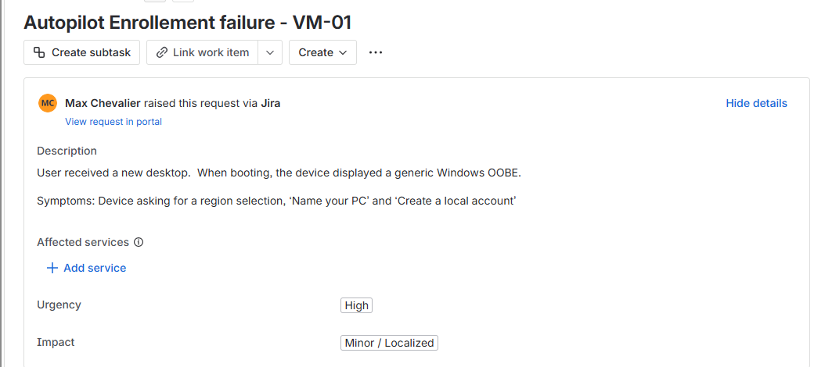
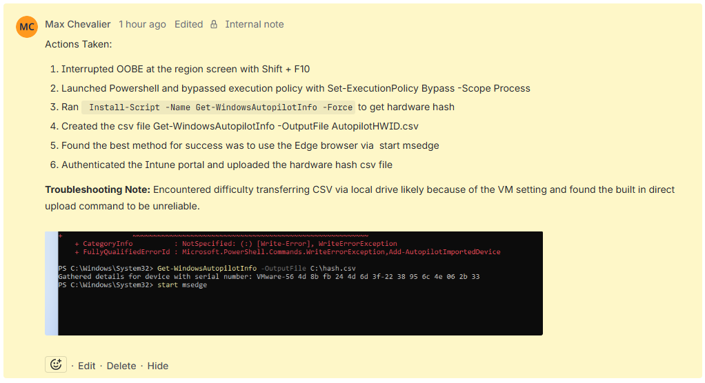

Goal: Implement a zero-touch (or low-touch) deployment strategy using Windows Autopilot to provision a corporate device
Solution: Utilized Microsoft Intune and Entra ID to configure the backend so that when a user connects their device it is compliant, productive in minutes via Out-of-Box Experience (OOBE)

Part 1: Incident Response (Autopilot Remediation)
   1. Problem Identification
      -  While provisioning a device (VM-01) the automated deployment failed - instead of tenant login screen, the device presented a generic consumer Windows Out-of-Box Experience (OOBE)
        - Symptom: Device prompted for Region selection and keyboard layout

  2. Technical fix
     I used Jira internal notes to document the remediations steps.  This serves as a Knowledge Base entry for the team
     - Action Taken: Interrupted OOBE via Shift + F10 to access the WinPE Command Line.
     - PowerShell Execution: Bypassed execution policy and ran Get-WindowsAutopilotInfo to harvest the hardware hash.
     - Engineering Workaround: "Used Edge browser via start msedge to authenticate the Intune portal and upload the hardware hash manually."

  3. Resolution
    - The incident was closed once the device successfully recognized the tenant on reboot.
    - By documenting the start msedge workaround, I provided the team with a faster alternative to troubleshooting virtual drive mounting in the future.

Part 2: Modern Autopilot Workflow
    1. Service Request:
      - Request Type: New Hire Device Provisioning
[INSERT SCREENSHOT 1 & 2 HERE]
(Caption: Jira Service Request setup and final SOAR resolution notes)

    2. Technical Configuration
      1. Hardware Hash Registration: Harvested and Registered the Hardware Hash into Autopilot Devices
[INSERT SCREENSHOT 7 HERE]
(Caption: Windows Autopilot devices blade showing the hardware serial number and 'Assigned' profile status)

    3. User Experience (Out-of-Box Experience)
      Goal is to allow for an employee to receive a new laptop and reach a productive state effectively and securely
      1. Identity and Security: 
        - Upon boot, the device recognized the Intune/Autopilot tenant.  
        - The user was prompted for the corporate credentials and was required to verify an MFA prompt via Micsofot Authenticator App
        - Windows Hello for Busines (WHfB):  User created a mandatory PIN setup, tied to local TPM encrypted storage and replacing insecure passwords

    [INSERT SCREENSHOTS 3, 4, 5 HERE]
(Caption: Branded OOBE login, MFA Approval via Authenticator, and Windows Hello PIN setup)

    4. Verification of Management and Compliance
      Management Verification: Verfiied via the local 'Access Work or School' setting that the device is connected to the MaxTicketLab Entra ID

    SCREENSOHT

      Compliance Check: In the Intune portal, verified that device status return a 'Compliant' flag.

[INSERT SCREENSHOTS 6 & 8 HERE]
(Caption: Local device settings showing Entra ID Join and Intune Portal showing 'Compliant' status)
    
